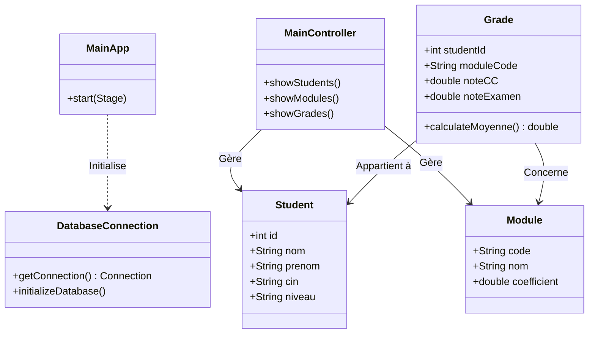
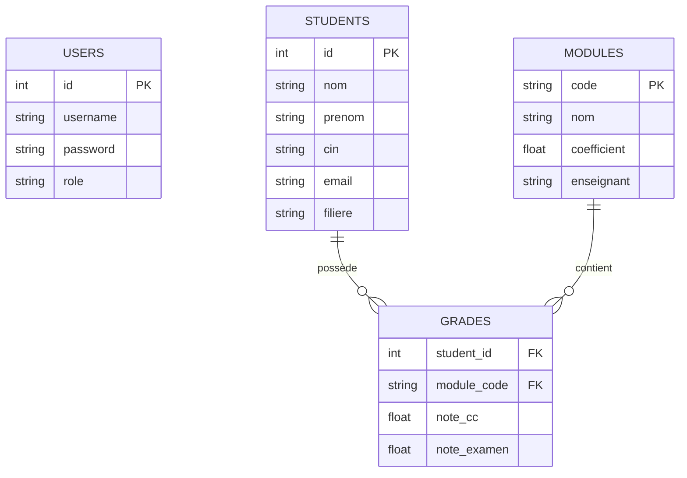

# Documentation Technique - Système de Gestion Académique

Ce document présente l'architecture logicielle et la structure des données du projet.

## 1. Diagramme de Classes (Architecture MVC)

Le projet suit le design pattern **MVC** (Modèle-Vue-Contrôleur) pour assurer une séparation nette entre la logique métier et l'interface utilisateur.

## 2. Modèle Conceptuel de Données (MCD)

La base de données SQLite est structurée pour optimiser les relations entre les étudiants, les modules et les notes.

## 3. Logique de Calcul des Notes

Le système applique la règle suivante pour le calcul de la réussite :
- **Moyenne** = `(Note CC * 0.4) + (Note Examen * 0.6)`
- **Validation** : Admise si `Moyenne >= 10`.
- **Mentions** :
    - `< 10` : Ajourné
    - `[10, 12[` : Passable
    - `[12, 14[` : Assez Bien
    - `[14, 16[` : Bien
    - `>= 16` : Très Bien

## 4. Gestion des Thèmes

L'application utilise une architecture de styles dynamique :
- `base.css` : Structures de base et animations.
- `light-theme.css` : Couleurs claires et effets de transparence.
- `dark-theme.css` : Mode sombre avec esthétique "Cyber-Glass".
